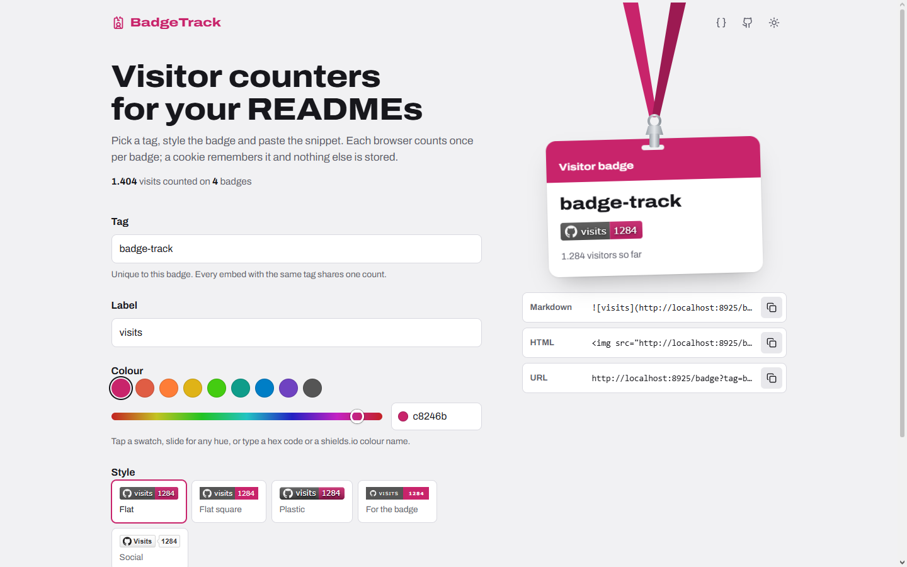
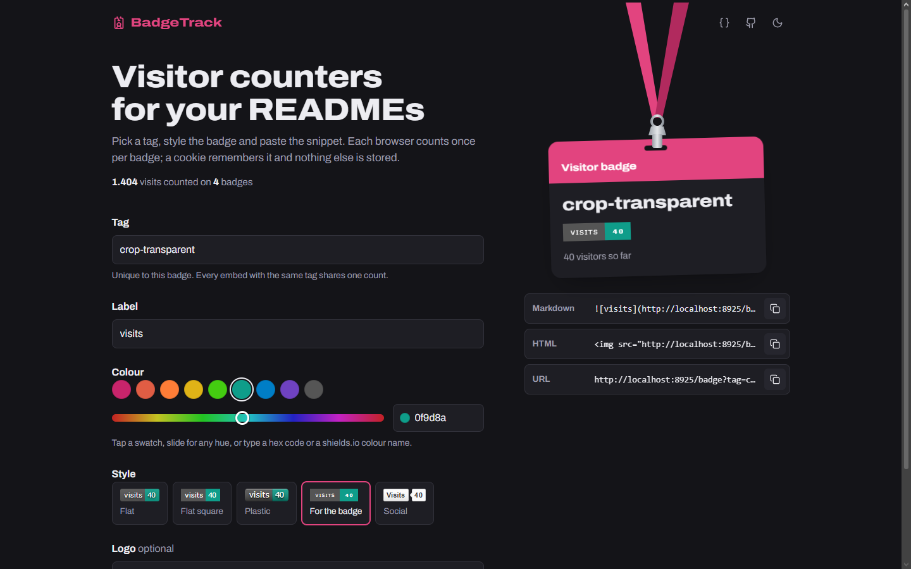
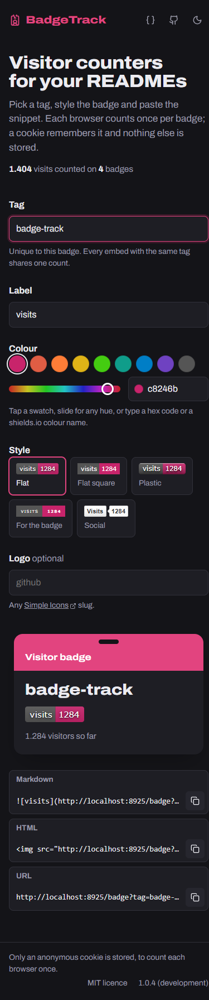

<p align="center">
  
</p>

<h1 align="center">BadgeTrack</h1>

<p align="center">
  <strong>Visitor counter badges for your READMEs and websites. Each browser counts once per badge.</strong>
</p>

<p align="center">
  <a href="https://github.com/PianoNic/BadgeTrack"></a>
  <a href="https://github.com/PianoNic/BadgeTrack/blob/main/LICENSE"></a>
  <a href="https://github.com/PianoNic/BadgeTrack/releases"></a>
  <a href="https://badgetrack.pianonic.ch"></a>
  <a href="docs/self-hosting.md"></a>
</p>

## Screenshots

<p align="center">
  
  
</p>

<details>
<summary><strong>Mobile</strong></summary>

<p align="center">
  
</p>

</details>

## Features

- **Unique visitors**: each browser is counted once per badge, remembered by an anonymous cookie. Nothing else is stored.
- **Updates right away**: the badge image is served with caching turned off, so GitHub shows the new count on the next page load.
- **Any shields.io look**: every style (flat, flat square, plastic, for the badge, social), any colour and any [Simple Icons](https://simpleicons.org) logo.
- **Live preview**: the generator shows the real count and all five styles as you type, without counting a visit.
- **Self-hostable**: one container, one SQLite file.

## Quick start

Create a badge at [badgetrack.pianonic.ch](https://badgetrack.pianonic.ch), or write the URL yourself:

```markdown

```

## Documentation

- [Badge URL and API](docs/api.md): every parameter and the stats endpoints
- [Self-hosting](docs/self-hosting.md): Docker Compose, data volume and updating
- [Configuration](docs/configuration.md): environment variables
- [Development](docs/development.md): running from source, tests and linting
- [Architecture](docs/architecture.md): how the code is organised
- [Releasing](docs/releasing.md): how versions and images are published

## License

[MIT](LICENSE)
